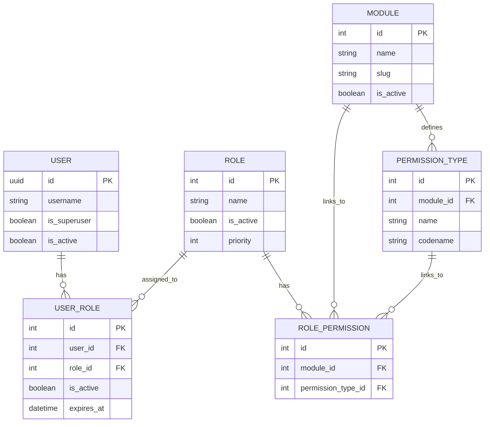

# Permission Checking System - Implementation Plan

## 1. Current System Architecture

### Data Model Relationships



### Permission Flow

```
User -> UserRole (active assignments) -> Role -> RolePermission -> Module + PermissionType
                                                                      |
                                                                      v
                                                           "module_slug_permission_codename"
```

---

## 2. Implementation - Step by Step

### Step 1: Fix and Enhance User Model Methods

Update `accounts/models.py` with improved permission methods:

```python
from django.contrib.auth import get_user_model
from django.core.cache import cache
from django.db import models
from django.db.models import Q
from django.utils import timezone

User = get_user_model()

class User(AbstractUser):
    # ... existing fields ...
    
    # ==================== Permission Methods (Enhanced) ====================
    
    def get_all_permissions(self, force_refresh=False):
        """
        Get all aggregated permissions from all active roles.
        Uses caching for performance.
        
        Args:
            force_refresh: If True, bypass cache and rebuild permissions
            
        Returns:
            set: Permission strings like {'students_view', 'fees_add'}
        """
        if not self.is_active:
            return set()

        # Superusers have all permissions
        if self.is_superuser:
            return {"*"}  # Wildcard for superuser

        # Check cache first (unless force_refresh)
        if not force_refresh:
            cache_key = f"user_perms_{self.id}"
            cached = cache.get(cache_key)
            if cached is not None:
                return cached

        permissions = set()

        # Aggregate permissions from all active role assignments
        active_assignments = self.user_roles.filter(
            is_active=True, 
            role__is_active=True
        ).select_related("role").prefetch_related("role__permissions__module", "role__permissions__permission_type")

        for user_role in active_assignments:
            if user_role.is_expired():
                continue
            for role_perm in user_role.role.permissions.all():
                perm_string = f"{role_perm.module.slug}_{role_perm.permission_type.codename}"
                permissions.add(perm_string)

        # Check for denied permissions (explicit denies override grants)
        denied = self._get_denied_permissions()
        if denied:
            # Remove any denied permissions
            permissions -= denied

        # Cache for 5 minutes (300 seconds)
        cache_key = f"user_perms_{self.id}"
        cache.set(cache_key, permissions, 300)
        
        return permissions

    def _get_denied_permissions(self):
        """
        Get explicitly denied permissions for this user.
        These override any granted permissions.
        
        Returns:
            set: Permission strings that are explicitly denied
        """
        # Placeholder for denied permissions feature
        # Could be implemented as a separate model
        return set()

    def has_permission(self, module_slug, permission_codename, force_refresh=False):
        """
        Check if user has a specific permission.
        
        Args:
            module_slug: Module identifier (e.g., 'students')
            permission_codename: Action (e.g., 'view', 'add')
            force_refresh: Bypass cache
            
        Returns:
            bool: True if user has permission
        """
        if self.is_superuser:
            return True

        if not self.is_active:
            return False

        # Check for explicit deny first
        denied = self._get_denied_permissions()
        permission_key = f"{module_slug}_{permission_codename}"
        if permission_key in denied:
            return False

        return permission_key in self.get_all_permissions(force_refresh)

    def has_any_permission(self, permissions_list, force_refresh=False):
        """
        Check if user has ANY of the specified permissions.
        
        Args:
            permissions_list: List of tuples [(module_slug, codename), ...]
            force_refresh: Bypass cache
            
        Returns:
            bool: True if user has at least one permission
        """
        user_perms = self.get_all_permissions(force_refresh)
        for module_slug, codename in permissions_list:
            if f"{module_slug}_{codename}" in user_perms:
                return True
        return False

    def has_all_permissions(self, permissions_list, force_refresh=False):
        """
        Check if user has ALL of the specified permissions.
        
        Args:
            permissions_list: List of tuples [(module_slug, codename), ...]
            force_refresh: Bypass cache
            
        Returns:
            bool: True if user has all permissions
        """
        user_perms = self.get_all_permissions(force_refresh)
        for module_slug, codename in permissions_list:
            if f"{module_slug}_{codename}" not in user_perms:
                return False
        return True

    def get_active_roles(self):
        """Get all active role assignments."""
        return (
            self.user_roles.filter(is_active=True, role__is_active=True)
            .filter(
                Q(expires_at__isnull=True) | Q(expires_at__gte=timezone.now())
            )
            .select_related("role")
        )

    def get_role_names(self):
        """Get names of all active roles."""
        return list(
            self.get_active_roles().values_list("role__name", flat=True)
        )

    def get_modules_with_permissions(self):
        """Get all modules with user's permissions."""
        result = {}
        for perm in self.get_all_permissions():
            parts = perm.rsplit("_", 1)
            if len(parts) == 2:
                module_slug, action = parts
                if module_slug not in result:
                    result[module_slug] = []
                result[module_slug].append(action)
        return result

    def get_highest_priority_role(self):
        """Get the highest priority active role."""
        active_roles = self.get_active_roles()
        if not active_roles.exists():
            return None
        return active_roles.order_by("-role__priority").first().role

    def clear_permission_cache(self):
        """Clear the cached permissions for this user."""
        cache_key = f"user_perms_{self.id}"
        cache.delete(cache_key)
```

### Step 2: Add Efficient Database Query Methods

Add these utility methods to the User model or create a separate service:

```python
def get_user_permissions_from_db(user_id):
    """
    Efficiently get user permissions using a single optimized query.
    Useful for admin interfaces and bulk operations.
    
    Args:
        user_id: ID of the user
        
    Returns:
        set: Permission strings
    """
    from roles.models import RolePermission, Module, PermissionType, UserRole
    
    # Single query using subquery and join
    permissions = RolePermission.objects.filter(
        role__user_assignments__user_id=user_id,
        role__user_assignments__is_active=True,
        role__user_assignments__role__is_active=True,
        role__is_active=True,
    ).values_list(
        'module__slug', 
        'permission_type__codename'
    ).distinct()
    
    return {f"{m[0]}_{m[1]}" for m in permissions}


def check_permission_efficient(user, module_slug, action):
    """
    Check permission using database query (no caching).
    Use when you need real-time accuracy.
    
    Args:
        user: User instance
        module_slug: Module identifier
        action: Permission action
        
    Returns:
        bool: True if user has permission
    """
    from roles.models import RolePermission, UserRole
    
    if user.is_superuser:
        return True
    
    if not user.is_active:
        return False
        
    return RolePermission.objects.filter(
        role__user_assignments__user=user,
        role__user_assignments__is_active=True,
        role__user_assignments__role__is_active=True,
        role__is_active=True,
        module__slug=module_slug,
        permission_type__codename=action,
    ).exists()
```

### Step 3: Create Permission Decorator

Create `roles/decorators.py`:

```python
from functools import wraps
from django.http import HttpResponseForbidden, HttpResponseRedirect
from django.contrib import messages

def permission_required(module_slug, permission_codename, login_url=None):
    """
    Decorator to check if user has a specific permission.
    
    Usage:
        @permission_required('students', 'view')
        def my_view(request):
            ...
    """
    def decorator(view_func):
        @wraps(view_func)
        def _wrapped(request, *args, **kwargs):
            if not request.user.is_authenticated:
                if login_url:
                    from django.contrib.auth.views import redirect_to_login
                    return redirect_to_login(request.get_full_path(), login_url)
                return HttpResponseForbidden("Authentication required.")
            
            if request.user.has_permission(module_slug, permission_codename):
                return view_func(request, *args, **kwargs)
            
            # Permission denied
            messages.error(request, f"You don't have permission to {permission_codename} {module_slug}")
            return HttpResponseForbidden("Permission denied.")
        return _wrapped
    return decorator


def permission_required_any(*permissions):
    """
    Decorator to check if user has ANY of the specified permissions.
    
    Usage:
        @permission_required_any(('students', 'view'), ('students', 'add'))
        def my_view(request):
            ...
    """
    def decorator(view_func):
        @wraps(view_func)
        def _wrapped(request, *args, **kwargs):
            if not request.user.is_authenticated:
                return HttpResponseForbidden("Authentication required.")
            
            if request.user.has_any_permission(permissions):
                return view_func(request, *args, **kwargs)
            
            messages.error(request, "You don't have required permissions.")
            return HttpResponseForbidden("Permission denied.")
        return _wrapped
    return decorator


def permission_required_all(*permissions):
    """
    Decorator to check if user has ALL of the specified permissions.
    
    Usage:
        @permission_required_all(('students', 'view'), ('students', 'edit'))
        def my_view(request):
            ...
    """
    def decorator(view_func):
        @wraps(view_func)
        def _wrapped(request, *args, **kwargs):
            if not request.user.is_authenticated:
                return HttpResponseForbidden("Authentication required.")
            
            if request.user.has_all_permissions(permissions):
                return view_func(request, *args, **kwargs)
            
            messages.error(request, "You don't have required permissions.")
            return HttpResponseForbidden("Permission denied.")
        return _wrapped
    return decorator


def role_required(role_name):
    """
    Decorator to check if user has a specific role.
    
    Usage:
        @role_required('admin')
        def my_view(request):
            ...
    """
    def decorator(view_func):
        @wraps(view_func)
        def _wrapped(request, *args, **kwargs):
            if not request.user.is_authenticated:
                return HttpResponseForbidden("Authentication required.")
            
            if role_name in request.user.get_role_names():
                return view_func(request, *args, **kwargs)
            
            messages.error(request, f"You must be a {role_name} to access this page.")
            return HttpResponseForbidden("Role requirement not met.")
        return _wrapped
    return decorator
```

### Step 4: Implement Denied Permissions (Optional Advanced Feature)

Add a new model for explicit permission denials:

```python
# roles/models.py additions

class PermissionDenial(models.Model):
    """
    Explicitly deny permissions to users or roles.
    Denials override grants - useful for temporary restrictions.
    """
    user = models.ForeignKey(
        User, 
        on_delete=models.CASCADE, 
        null=True, 
        blank=True,
        related_name="permission_denials"
    )
    role = models.ForeignKey(
        Role, 
        on_delete=models.CASCADE, 
        null=True, 
        blank=True,
        related_name="permission_denials"
    )
    module = models.ForeignKey(Module, on_delete=models.CASCADE)
    permission_type = models.ForeignKey(PermissionType, on_delete=models.CASCADE)
    reason = models.TextField(blank=True)
    denied_by = models.ForeignKey(
        User, 
        on_delete=models.SET_NULL, 
        null=True, 
        related_name="denied_permissions"
    )
    denied_at = models.DateTimeField(auto_now_add=True)
    expires_at = models.DateTimeField(null=True, blank=True)

    class Meta:
        unique_together = ["user", "role", "module", "permission_type"]

    def __str__(self):
        target = self.user or self.role
        return f"{target} denied {self.module.slug}_{self.permission_type.codename}"
```

### Step 5: Management Command for Cache Refresh

Create `roles/management/commands/refresh_permissions.py`:

```python
from django.core.management.base import BaseCommand
from django.contrib.auth import get_user_model

User = get_user_model()

class Command(BaseCommand):
    help = 'Refresh permission cache for all active users'

    def add_arguments(self, parser):
        parser.add_argument(
            '--user-id',
            type=int,
            help='Refresh cache for specific user ID',
        )

    def handle(self, *args, **options):
        if options['user_id']:
            users = User.objects.filter(id=options['user_id'])
        else:
            users = User.objects.filter(is_active=True)

        count = 0
        for user in users:
            user.clear_permission_cache()
            # Force refresh to rebuild cache
            user.get_all_permissions(force_refresh=True)
            count += 1

        self.stdout.write(
            self.style.SUCCESS(f'Successfully refreshed permissions for {count} users')
        )
```

### Step 6: Middleware for Request Context

Create `roles/middleware.py`:

```python
class PermissionContextMiddleware:
    """
    Middleware to add permission context to request.
    Provides quick access to common permission checks.
    """
    
    def __init__(self, get_response):
        self.get_response = get_response

    def __call__(self, request):
        # Add permission helper to request
        if request.user.is_authenticated:
            request.permission_cache = PermissionContext(request.user)
        
        response = self.get_response(request)
        return response


class PermissionContext:
    """Quick permission checking helper attached to request."""
    
    def __init__(self, user):
        self.user = user
        self._permissions = None
        self._roles = None
    
    @property
    def permissions(self):
        if self._permissions is None:
            self._permissions = self.user.get_all_permissions()
        return self._permissions
    
    @property
    def roles(self):
        if self._roles is None:
            self._roles = self.user.get_role_names()
        return self._roles
    
    def can(self, module, action):
        """Quick check: request.can('students', 'view')"""
        return f"{module}_{action}" in self.permissions
    
    def is(self, role):
        """Quick check: request.is('admin')"""
        return role in self.roles
```

---

## 3. Usage Examples

### In Views (Function-Based)

```python
# Direct method call
def student_list(request):
    if not request.user.has_permission('students', 'view'):
        return HttpResponseForbidden("Access denied")
    # ... view logic

# Using decorator
@permission_required('students', 'view')
def student_list(request):
    # User has permission, continue
    ...

@permission_required_any(('students', 'add'), ('students', 'edit'))
def student_form(request):
    # User can add OR edit
    ...

@permission_required_all(('students', 'view'), ('students', 'delete'))
def student_delete(request, pk):
    # User needs BOTH permissions
    ...
```

### In Views (Class-Based)

```python
from django.utils.decorators import method_decorator
from django.views import View

@method_decorator(permission_required('students', 'view'), name='dispatch')
class StudentListView(View):
    def get(self, request):
        ...

@method_decorator(permission_required('students', 'add'), name='dispatch')
class StudentCreateView(View):
    def post(self, request):
        ...
```

### In Templates

```html


<!-- Single permission -->

    <a href="">View Students</a>


<!-- Any permission (comma-separated) -->

    <a href="">Add Student</a>


<!-- All permissions -->

    <button onclick="deleteSelected()">Delete Selected</button>


<!-- Role check -->

    <a href="">Manage Roles</a>


<!-- Display user roles -->


    <span class="badge">{{ role }}</span>

```

### In Django Admin

```python
# students/admin.py
from django.contrib import admin
from .models import Student

@admin.register(Student)
class StudentAdmin(admin.ModelAdmin):
    list_display = ['name', 'class_level', 'roll_number']
    
    def has_view_permission(self, request, obj=None):
        return request.user.has_permission('students', 'view')
    
    def has_add_permission(self, request):
        return request.user.has_permission('students', 'add')
    
    def has_change_permission(self, request, obj=None):
        return request.user.has_permission('students', 'edit')
    
    def has_delete_permission(self, request, obj=None):
        return request.user.has_permission('students', 'delete')
    
    def has_module_permission(self, request):
        return request.user.has_permission('students', 'view')
```

---

## 4. Handling Edge Cases

### Edge Case 1: User with Multiple Roles

If a user has multiple roles, permissions are aggregated:

```python
# User has Role1 (students_view) and Role2 (students_add)
user.get_all_permissions()
# Returns: {'students_view', 'students_add'}
```

### Edge Case 2: Permission Denied Override

If a role grants permission but user has explicit denial:

```python
# Role grants 'students_view'
# But PermissionDenial denies 'students_view'
user.has_permission('students', 'view')
# Returns: False (denial takes precedence)
```

### Edge Case 3: Expired Role Assignment

Expired roles are automatically excluded:

```python
# UserRole has expires_at = 2024-01-01 (in the past)
user.get_active_roles()
# Does NOT include the expired assignment
```

### Edge Case 4: Inactive Role

Inactive roles are excluded:

```python
# Role has is_active = False
user.get_all_permissions()
# Does NOT include permissions from inactive role
```

### Edge Case 5: Superuser Bypass

Superusers bypass all permission checks:

```python
# User is_superuser = True
user.has_permission('any_module', 'any_action')
# Returns: True (always)
```

---

## 5. Performance Considerations

### Caching Strategy

1. **Per-User Cache**: Permissions cached for 5 minutes per user
2. **Cache Invalidation**: Call `user.clear_permission_cache()` when:
   - User's role assignments change
   - Role's permissions change
   - Role is activated/deactivated

### Optimized Queries

```python
# Bad: N+1 query problem
for user in users:
    for perm in user.get_all_permissions():  # Query for each user
        ...

# Good: Single query for all users
from roles.models import RolePermission
perms = RolePermission.objects.filter(
    role__user_assignments__user__in=user_ids,
    ...
).values_list('role__user_assignments__user_id', 'module__slug', 'permission_type__codename')
```

---

## 6. Testing

```python
# tests/test_permissions.py
from django.test import TestCase
from django.contrib.auth import get_user_model
from roles.models import Module, PermissionType, Role, RolePermission, UserRole

User = get_user_model()

class PermissionTests(TestCase):
    def setUp(self):
        # Create module
        self.module = Module.objects.create(name='Students', slug='students')
        
        # Create permission types
        self.view_perm = PermissionType.objects.create(
            module=self.module, name='View', codename='view'
        )
        
        # Create role with permission
        self.role = Role.objects.create(name='Teacher')
        self.role_permission = RolePermission.objects.create(
            module=self.module, permission_type=self.view_perm
        )
        self.role.permissions.add(self.role_permission)
        
        # Create user with role
        self.user = User.objects.create_user(username='teacher1')
        UserRole.objects.create(user=self.user, role=self.role)
    
    def test_user_has_permission(self):
        """Test user has permission from role."""
        self.assertTrue(self.user.has_permission('students', 'view'))
    
    def test_user_lacks_permission(self):
        """Test user doesn't have unassigned permission."""
        self.assertFalse(self.user.has_permission('students', 'delete'))
    
    def test_superuser_has_all(self):
        """Test superuser bypasses permission checks."""
        admin = User.objects.create_superuser(username='admin')
        self.assertTrue(admin.has_permission('any', 'permission'))
    
    def test_inactive_user_has_no_permissions(self):
        """Test inactive user has no permissions."""
        self.user.is_active = False
        self.assertFalse(self.user.has_permission('students', 'view'))
```

---

## 7. Implementation Checklist

- [ ] Review and update User model permission methods
- [ ] Add caching to `get_all_permissions()`
- [ ] Create permission decorators
- [ ] Add middleware for request context
- [ ] Create management command for cache refresh
- [ ] (Optional) Implement PermissionDenial model
- [ ] Add permission checks to existing views
- [ ] Add tests for permission system
- [ ] Document usage patterns
